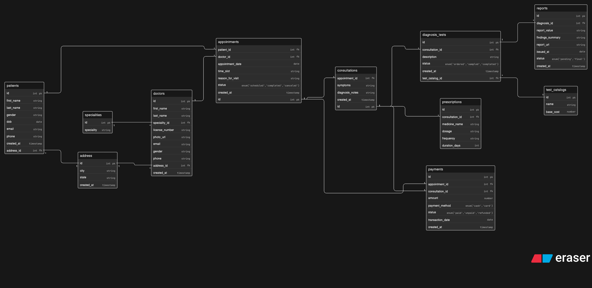

# Clinic Appointment and Diagnostics Platform — Database Design



A relational database design for a clinic platform that manages patients, doctors, appointments, consultations, diagnostic tests, reports, prescriptions, and payments end to end.

---

## Table of Contents

- [Overview](#overview)
- [Entities](#entities)
- [Entity Descriptions](#entity-descriptions)
- [Relationships & Cardinality](#relationships--cardinality)
- [Key Design Decisions](#key-design-decisions)
- [ERD (Eraser.io)](#erd-eraserio)

---

## Overview

This database supports the following business questions:

- Who are the doctors and what are their specialties?
- Which patient booked which appointment?
- What was the appointment status?
- Did the appointment result in a consultation?
- Were any diagnostic tests prescribed during the consultation?
- What reports were generated from those tests?
- Can one patient have many visits over time?
- Can one doctor attend many patients?
- Can one consultation lead to multiple tests?
- How is payment connected to appointments and consultations?

---

## Entities

| Entity            | Purpose                                                       |
| ----------------- | ------------------------------------------------------------- |
| `patients`        | People who visit the clinic                                   |
| `address`         | Shared city and state reference for patients and doctors      |
| `specialities`    | Medical specialties that doctors belong to                    |
| `doctors`         | Clinic doctors linked to a specialty and address              |
| `appointments`    | A booking made by a patient with a doctor                     |
| `consultations`   | The actual visit that happens after an appointment            |
| `prescriptions`   | Medicines prescribed during a consultation                    |
| `test_catalogs`   | Master list of available diagnostic tests and their base cost |
| `diagnosis_tests` | Tests ordered for a patient during a consultation             |
| `reports`         | Results generated after a diagnostic test is completed        |
| `payments`        | Payment record linked to an appointment and/or consultation   |

---

## Entity Descriptions

### `patients`

Stores the personal details of every patient registered on the platform.

```
id            int         PK
first_name    string
last_name     string
gender        string
dob           date
email         string
phone         string
address_id    int         FK → address.id
created_at    timestamp
```

---

### `address`

A shared reference table for city and state. Both patients and doctors point to this table via `address_id`. Centralizing city and state here prevents update anomalies — if a city name needs to change, one row update reflects across all linked records.

```
id            int         PK
city          string
state         string
created_at    timestamp
```

---

### `specialities`

A lookup table for medical specialties such as Cardiology, Pediatrics, Orthopedics. Kept separate so specialties are consistent and not typed freehand on every doctor record.

```
id            int         PK
speciality    string
```

---

### `doctors`

Stores doctor details. Each doctor belongs to one specialty and one address record.

```
id                int         PK
first_name        string
last_name         string
speciality_id     int         FK → specialities.id
license_number    string
photo_url         string
email             string
gender            string
phone             string
address_id        int         FK → address.id
created_at        timestamp
```

---

### `appointments`

Created when a patient books a slot with a doctor. This is the entry point of every clinic visit. An appointment may or may not result in a consultation depending on whether the patient shows up.

```
id                  int         PK
patient_id          int         FK → patients.id
doctor_id           int         FK → doctors.id
appointment_date    date
time_slot           string
reason_for_visit    string
status              enum        -- 'scheduled' | 'completed' | 'canceled'
created_at          timestamp
```

---

### `consultations`

The actual clinical visit that results from a completed appointment. Stores what the doctor observed and diagnosed. One appointment produces at most one consultation (1:1).

```
id                int         PK
appointment_id    int         FK → appointments.id
symptoms          string
diagnosis_notes   string
created_at        timestamp
```

---

### `prescriptions`

Medicines prescribed by the doctor during a consultation. Stored as individual rows per medicine so each item can be tracked, queried, and updated independently. One consultation can have many prescriptions.

```
id                  int         PK
consultation_id     int         FK → consultations.id
medicine_name       string
dosage              string
frequency           string
duration_days       int
```

---

### `test_catalogs`

A master catalog of all diagnostic tests the clinic offers, along with their base cost. Tests ordered for patients reference this catalog so test names and costs stay consistent.

```
id            int         PK
name          string
base_cost     number
```

---

### `diagnosis_tests`

Records each diagnostic test ordered for a patient during a consultation. References `test_catalogs` for the test type. One consultation can have many tests ordered.

```
id                  int         PK
consultation_id     int         FK → consultations.id
test_catalog_id     int         FK → test_catalogs.id
description         string
status              enum        -- 'ordered' | 'sampled' | 'completed'
created_at          timestamp
```

---

### `reports`

The result generated after a diagnostic test is completed. Linked directly to `diagnosis_tests` because a report is always the outcome of a specific test. The chain is: consultation → diagnosis_test → report.

```
id                  int         PK
diagnosis_id        int         FK → diagnosis_tests.id
report_value        string
findings_summary    string
report_url          string
issued_at           date
status              enum        -- 'pending' | 'final'
created_at          timestamp
```

---

### `payments`

Stores payment records for clinic visits. Has both `appointment_id` and `consultation_id` as foreign keys — both nullable — because payment can happen at different stages depending on the clinic's billing model.

```
id                    int         PK
appointment_id        int         FK → appointments.id      (nullable)
consultation_id       int         FK → consultations.id     (nullable)
amount                number
payment_method        enum        -- 'cash' | 'card'
status                enum        -- 'paid' | 'unpaid' | 'refunded'
transaction_date      date
created_at            timestamp
```

---

## Relationships & Cardinality

| Relationship                        | Type     | Notes                                                             |
| ----------------------------------- | -------- | ----------------------------------------------------------------- |
| `address` → `patients`              | 1 : N    | One city/state record shared by many patients                     |
| `address` → `doctors`               | 1 : N    | One city/state record shared by many doctors                      |
| `specialities` → `doctors`          | 1 : N    | One specialty can have many doctors                               |
| `patients` → `appointments`         | 1 : N    | One patient can book many appointments over time                  |
| `doctors` → `appointments`          | 1 : N    | One doctor can have many appointments                             |
| `appointments` → `consultations`    | 1 : 0..1 | An appointment may or may not result in a consultation            |
| `consultations` → `prescriptions`   | 1 : N    | One consultation can produce many prescriptions                   |
| `consultations` → `diagnosis_tests` | 1 : N    | One consultation can order many tests                             |
| `test_catalogs` → `diagnosis_tests` | 1 : N    | One catalog item can be ordered many times                        |
| `diagnosis_tests` → `reports`       | 1 : N    | One test can produce multiple report entries (pending then final) |
| `appointments` → `payments`         | 1 : 0..1 | Payment may be linked to booking stage (nullable)                 |
| `consultations` → `payments`        | 1 : 0..1 | Payment may be linked to post-consultation billing (nullable)     |

---

## Key Design Decisions

**Single `address` table shared by patients and doctors**
City and state are reusable values. Storing them in a central table means a correction to a city name requires updating one row, not hundreds. Personal details like street or pincode are not stored here — those are unique per person and should live on the respective table directly.

**`appointments` and `consultations` are separate tables**
An appointment is a booking — it might get canceled and never result in a visit. A consultation is the actual clinical event. Keeping them separate lets the system track no-shows, cancellations, and completed visits independently. The relationship is 1:0..1 — one appointment produces at most one consultation.

**`prescriptions` extracted from `consultations`**
Storing prescriptions as a plain string inside `consultations` makes it impossible to query individual medicines or build medication history. Each prescription is its own row with structured fields for medicine name, dosage, frequency, and duration.

**`reports` linked to `diagnosis_tests`, not `consultations` directly**
A report is always the result of a specific test, not of a consultation directly. The chain consultation → diagnosis_test → report is clean and logically correct. You can always reach the consultation by joining through `diagnosis_tests`.

**`payments` has both `appointment_id` and `consultation_id` as nullable FKs**
Different clinics bill at different stages. Some collect payment at booking, others after the full consultation and tests. Making both FKs nullable means the system supports both models — whichever stage the payment belongs to gets filled, the other remains null.

**`test_catalogs` as a master reference table**
Test names and base costs should not be typed freehand on every order. A central catalog ensures consistency and makes it easy to update a test's cost in one place without affecting historical order records.

---

## ERD (Eraser.io)

Paste the code below into [eraser.io](https://eraser.io) using the **Entity Relationship Diagram** template.

```
title Clinic Appointment and Diagnostics Platform

patients {
  id int pk
  first_name string
  last_name string
  gender string
  dob date
  email string
  phone string
  address_id int fk
  created_at timestamp
}

address {
  id int pk
  city string
  state string
  created_at timestamp
}

specialities {
  id int pk
  speciality string
}

doctors {
  id int pk
  first_name string
  last_name string
  speciality_id int fk
  license_number string
  photo_url string
  email string
  gender string
  phone string
  address_id int fk
  created_at timestamp
}

appointments {
  id int pk
  patient_id int fk
  doctor_id int fk
  appointment_date date
  time_slot string
  reason_for_visit string
  status enum('scheduled','completed','canceled')
  created_at timestamp
}

prescriptions {
  id int pk
  consultation_id int fk
  medicine_name string
  dosage string
  frequency string
  duration_days int
}

consultations {
  id int pk
  appointment_id int fk
  symptoms string
  diagnosis_notes string
  created_at timestamp
}

test_catalogs {
  id int pk
  name string
  base_cost number
}

diagnosis_tests {
  id int pk
  consultation_id int fk
  test_catalog_id int fk
  description string
  status enum('ordered','sampled','completed')
  created_at timestamp
}

reports {
  id int pk
  diagnosis_id int fk
  report_value string
  findings_summary string
  report_url string
  issued_at date
  status enum('pending','final')
  created_at timestamp
}

payments {
  id int pk
  appointment_id int fk
  consultation_id int fk
  amount number
  payment_method enum('cash','card')
  status enum('paid','unpaid','refunded')
  transaction_date date
  created_at timestamp
}

patients.id < appointments.patient_id
doctors.id < appointments.doctor_id
patients.address_id > address.id
address.id < doctors.address_id
specialities.id < doctors.speciality_id
appointments.id - consultations.appointment_id
appointments.id - payments.appointment_id
consultations.id < diagnosis_tests.consultation_id
consultations.id < prescriptions.consultation_id
diagnosis_tests.test_catalog_id > test_catalogs.id
diagnosis_tests.id < reports.diagnosis_id
consultations.id - payments.consultation_id
```

---

Thanks for reading this ☺️
