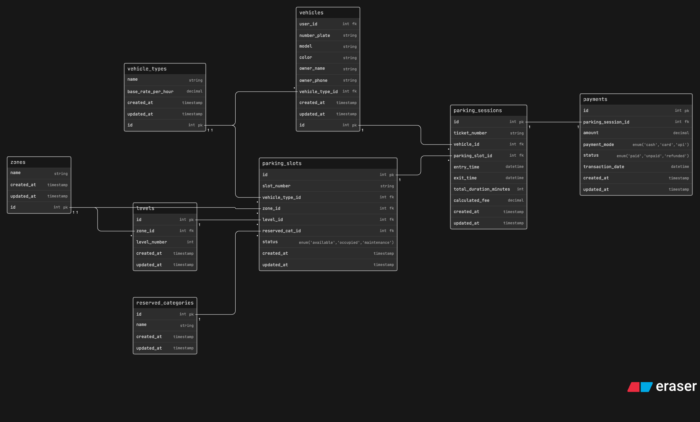

# Comic-Con India — Parking Management System — Database Design


A relational database design for a multi-zone event parking system that tracks vehicle entry and exit, spot allocation, reserved categories, parking sessions, and payments across multiple days of Comic-Con India.

---

## Table of Contents

- [Overview](#overview)
- [Entities](#entities)
- [Entity Descriptions](#entity-descriptions)
- [Relationships & Cardinality](#relationships--cardinality)
- [Key Design Decisions](#key-design-decisions)
- [ERD (Eraser.io)](#erd-eraserio)

---

## Overview

This database supports the following business questions:

- What vehicles entered the parking facility?
- What type of vehicle entered?
- Which parking spot was assigned?
- Which zone and level does that parking spot belong to?
- Was the parking spot reserved for cosplayers, exhibitors, VIP guests, staff, or EV charging?
- When did the vehicle enter and exit the facility?
- What ticket was issued for the parking session?
- Can one vehicle visit the venue multiple times across different days?
- Can one parking spot be reused across multiple parking sessions?
- How is parking availability tracked?
- How are parking charges calculated?
- How is payment recorded for each parking session?
- Which vehicles are currently parked inside the venue?

---

## Entities

| Entity                | Purpose                                                                                            |
| --------------------- | -------------------------------------------------------------------------------------------------- |
| `vehicle_types`       | Lookup table for vehicle categories — bike, car, SUV, EV etc.                                      |
| `reserved_categories` | Lookup table for reserved access types — VIP, staff, cosplay, exhibitor etc.                       |
| `zones`               | Physical zones inside the parking facility                                                         |
| `levels`              | Levels within each zone — Level 1, Level 2 etc.                                                    |
| `parking_slots`       | Individual parking spots linked to a level, vehicle type, and reserved category                    |
| `vehicles`            | Every vehicle that registers or enters the facility                                                |
| `parking_sessions`    | One record per vehicle visit — holds ticket number, entry/exit times, duration, and calculated fee |
| `payments`            | Payment record linked one-to-one with each parking session                                         |

---

## Entity Descriptions

### `vehicle_types`

Lookup table for all vehicle categories the parking system supports. Using a `name` string instead of an enum means new vehicle types can be added as rows without changing the schema.

```
id                    int         PK
name                  string      -- 'bike', 'car', 'suv', 'ev', 'bus' etc.
base_rate_per_hour    decimal
created_at            timestamp
updated_at            timestamp
```

---

### `reserved_categories`

Lookup table for special access categories. Some parking spots are reserved exclusively for certain groups. Using `name string` keeps this flexible for future categories.

```
id            int         PK
name          string      -- 'vip', 'staff', 'cosplay', 'exhibitor', 'ev_charging' etc.
created_at    timestamp
updated_at    timestamp
```

---

### `zones`

Represents the physical zones of the parking facility — Zone A, Zone B, Zone C etc. Each zone contains multiple levels and slots.

```
id            int         PK
name          string
created_at    timestamp
updated_at    timestamp
```

---

### `levels`

Represents individual levels within a zone. A level always belongs to one zone. Keeping levels as a proper table instead of a freehand string prevents inconsistent naming like "Level 1", "level1", "L1" all meaning the same thing.

```
id              int         PK
zone_id         int         FK → zones.id
level_number    int
created_at      timestamp
updated_at      timestamp
```

---

### `parking_slots`

Individual parking spots. Each slot belongs to a level (which already implies a zone, so zone_id is not duplicated here), is sized for a specific vehicle type, and may be reserved for a special access category. The `status` column is a real-time cache — the ground truth for availability is always derivable from `parking_sessions`.

```
id                  int         PK
slot_number         string
level_id            int         FK → levels.id
vehicle_type_id     int         FK → vehicle_types.id
reserved_cat_id     int         FK → reserved_categories.id    (nullable)
status              enum        -- 'available' | 'occupied' | 'maintenance'
created_at          timestamp
updated_at          timestamp
```

---

### `vehicles`

Every vehicle that enters or is registered at the facility. Linked to a vehicle type. Owner name and phone are optional fields — walk-in vehicles do not need a registered user account. One vehicle can have many parking sessions across multiple days.

```
id                  int         PK
number_plate        string
model               string
color               string
vehicle_type_id     int         FK → vehicle_types.id
owner_name          string      (nullable)
owner_phone         string      (nullable)
created_at          timestamp
updated_at          timestamp
```

---

### `parking_sessions`

The core table of the entire system. One row is created when a vehicle enters. It holds the ticket number, assigned slot, entry time, exit time, total duration, and calculated fee. One vehicle can have many sessions across different days. One slot can serve many sessions over time.

```
id                          int         PK
ticket_number               string
vehicle_id                  int         FK → vehicles.id
parking_slot_id             int         FK → parking_slots.id
entry_time                  datetime
exit_time                   datetime    (nullable — null means vehicle is still inside)
total_duration_minutes      int         (nullable — calculated on exit)
calculated_fee              decimal     (nullable — calculated on exit)
created_at                  timestamp
updated_at                  timestamp
```

---

### `payments`

One payment record per parking session — strictly one to one. Created when the vehicle exits and the fee is calculated. Holds the amount, payment method, and status.

```
id                    int         PK
parking_session_id    int         FK → parking_sessions.id
amount                decimal
payment_mode          enum        -- 'cash' | 'card' | 'upi'
status                enum        -- 'paid' | 'unpaid' | 'refunded'
transaction_date      datetime
created_at            timestamp
updated_at            timestamp
```

---

## Relationships & Cardinality

| Relationship                            | Type  | Notes                                            |
| --------------------------------------- | ----- | ------------------------------------------------ |
| `zones` → `levels`                      | 1 : N | One zone contains many levels                    |
| `levels` → `parking_slots`              | 1 : N | One level contains many parking slots            |
| `vehicle_types` → `parking_slots`       | 1 : N | One vehicle type maps to many slots sized for it |
| `reserved_categories` → `parking_slots` | 1 : N | One reserved category applies to many slots      |
| `vehicle_types` → `vehicles`            | 1 : N | One vehicle type applies to many vehicles        |
| `vehicles` → `parking_sessions`         | 1 : N | One vehicle can have many sessions across days   |
| `parking_slots` → `parking_sessions`    | 1 : N | One slot can serve many vehicles over time       |
| `parking_sessions` → `payments`         | 1 : 1 | One session produces exactly one payment record  |

---

## Key Design Decisions

**`tickets` and `parking_sessions` merged into one table**
A ticket is issued when a vehicle enters — it records the slot, entry time, exit time, duration, and fee. There is no meaningful separation between a ticket and a session in this system. Splitting them into two tables creates unnecessary complexity where one table is just a shell of the other. Merging them into `parking_sessions` with a `ticket_number` column keeps the design clean and practical.

**`levels` extracted as its own table**
The instructions specifically mention zones and levels as separate structural concepts. Storing level as a freehand string on `parking_slots` leads to naming inconsistencies — "Level 1", "level1", "L1" could all mean the same thing with no constraint to stop it. A proper `levels` table with `zone_id` FK enforces consistency and allows queries like "how many available slots are on Level 2 of Zone B?"

**`zone_id` not duplicated on `parking_slots`**
A slot already knows its zone through its `level_id` → `levels.zone_id` chain. Storing `zone_id` directly on `parking_slots` as well creates a risk of contradicting data — the slot could say Zone A while its level says Zone B. Since data can be reached by following the FK chain, it is not duplicated. This is Third Normal Form (3NF).

**`vehicle_types` and `reserved_categories` use `name string` instead of enum**
Enums are locked into the schema — adding a new vehicle type or reserved category requires a database migration. Using a `name` string column means new types are added as rows, not schema changes. This is essential for an event system where new categories may appear for future Comic-Con editions.

**`users` table removed**
The instructions describe a vehicle tracking system, not a user registration platform. Most vehicles at Comic-Con drive in without any pre-registration. Requiring every vehicle to be linked to a registered user breaks walk-in scenarios. `owner_name` and `owner_phone` are kept as nullable optional fields directly on `vehicles`.

**`parking_sessions` → `payments` is strictly One to One**
One parking visit generates one bill and one payment record. Making this One to Many would allow multiple payment rows per session, which breaks financial queries — `SUM(amount)` would return inflated totals, and `status` could simultaneously show paid and unpaid for the same session. One to One enforces that each session has exactly one payment record, always.

**`calculated_fee` stored on `parking_sessions`**
When a vehicle exits, the system computes `total_duration_minutes × base_rate_per_hour` from `vehicle_types`. Storing the result in `calculated_fee` on the session makes `payments.amount` fully traceable — you always know how the charge was derived without recalculating it every time.

**`exit_time` and `calculated_fee` are nullable**
These fields are empty when the vehicle first enters. They are filled only when the vehicle exits. A null `exit_time` means the vehicle is currently inside the venue — this is how the system tracks which vehicles are actively parked.

---

## ERD (Eraser.io)

Paste the code below into [eraser.io](https://eraser.io) using the **Entity Relationship Diagram** template.

```
title Comic-Con India — Parking Management System

vehicle_types {
  id int pk
  name string
  base_rate_per_hour decimal
  created_at timestamp
  updated_at timestamp
}

reserved_categories {
  id int pk
  name string
  created_at timestamp
  updated_at timestamp
}

zones {
  id int pk
  name string
  created_at timestamp
  updated_at timestamp
}

levels {
  id int pk
  zone_id int fk
  level_number int
  created_at timestamp
  updated_at timestamp
}

parking_slots {
  id int pk
  slot_number string
  level_id int fk
  vehicle_type_id int fk
  reserved_cat_id int fk
  status enum('available','occupied','maintenance')
  created_at timestamp
  updated_at timestamp
}

vehicles {
  id int pk
  number_plate string
  model string
  color string
  vehicle_type_id int fk
  owner_name string
  owner_phone string
  created_at timestamp
  updated_at timestamp
}

parking_sessions {
  id int pk
  ticket_number string
  vehicle_id int fk
  parking_slot_id int fk
  entry_time datetime
  exit_time datetime
  total_duration_minutes int
  calculated_fee decimal
  created_at timestamp
  updated_at timestamp
}

payments {
  id int pk
  parking_session_id int fk
  amount decimal
  payment_mode enum('cash','card','upi')
  status enum('paid','unpaid','refunded')
  transaction_date datetime
  created_at timestamp
  updated_at timestamp
}

zones.id < levels.zone_id
levels.id < parking_slots.level_id
vehicle_types.id < parking_slots.vehicle_type_id
reserved_categories.id < parking_slots.reserved_cat_id
vehicle_types.id < vehicles.vehicle_type_id
vehicles.id < parking_sessions.vehicle_id
parking_slots.id < parking_sessions.parking_slot_id
parking_sessions.id - payments.parking_session_id
```
