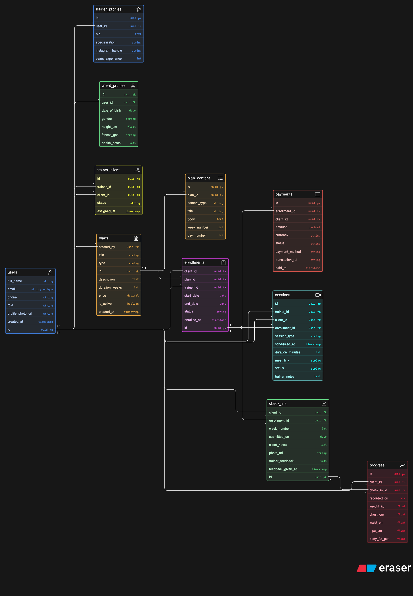

# Fitness Coaching Platform — Database Design

An online coaching ecosystem where trainers/influencers manage multiple clients and provide structured fitness support including plans, sessions, check-ins, progress tracking, and payments.

---



## Table of Contents

- [Overview](#overview)
- [Entities](#entities)
- [Entity Descriptions](#entity-descriptions)
- [Relationships & Cardinality](#relationships--cardinality)
- [Key Design Decisions](#key-design-decisions)
- [ERD (Eraser.io)](#erd-eraserio)

---

## Overview

This database supports:

- Multiple trainers managing multiple clients
- Selling and subscribing to fitness plans (workout, diet, combo)
- Scheduling one-on-one sessions and consultations
- Weekly client check-ins with trainer feedback
- Progress tracking (weight, measurements, body fat)
- Payment and subscription management

---

## Entities

| Entity             | Purpose                                                                            |
| ------------------ | ---------------------------------------------------------------------------------- |
| `users`            | All platform users — trainers and clients share one table, distinguished by `role` |
| `trainer_profiles` | Trainer-specific data: bio, specialization, experience                             |
| `client_profiles`  | Client-specific data: fitness goal, health notes, height                           |
| `trainer_client`   | Maps which trainer is assigned to which client (many-to-many)                      |
| `plans`            | Coaching programs created by trainers (workout / diet / combo / consultation)      |
| `plan_content`     | Week-by-week content inside a plan (exercises, meals, notes)                       |
| `enrollments`      | Records a client purchasing/subscribing to a plan — the core join table            |
| `payments`         | Payment record linked to each enrollment                                           |
| `sessions`         | Scheduled video calls or live sessions between trainer and client                  |
| `check_ins`        | Weekly self-reports submitted by clients, with trainer feedback                    |
| `progress`         | Numerical body measurements captured during a check-in                             |

---

## Entity Descriptions

### `users`

The base identity table for everyone on the platform. Both trainers and clients are stored here. The `role` field (`"trainer"` or `"client"`) determines what profile and permissions apply.

```
id              uuid        PK
full_name       string
email           string      UNIQUE
phone           string
role            string      -- "trainer" | "client"
profile_photo_url string
created_at      timestamp
```

---

### `trainer_profiles`

Extended profile for users who are trainers.

```
id                uuid    PK
user_id           uuid    FK → users.id
bio               text
specialization    string
instagram_handle  string
years_experience  int
```

---

### `client_profiles`

Extended profile for users who are clients.

```
id              uuid    PK
user_id         uuid    FK → users.id
date_of_birth   date
gender          string
height_cm       float
fitness_goal    string
health_notes    text
```

---

### `trainer_client`

Resolves the many-to-many relationship between trainers and clients. A trainer can coach many clients; a client could theoretically have co-coaches.

```
id            uuid        PK
trainer_id    uuid        FK → users.id
client_id     uuid        FK → users.id
status        string      -- "active" | "paused" | "ended"
assigned_at   timestamp
```

---

### `plans`

A catalog of coaching programs created by a trainer. Plans are templates — clients subscribe to them via `enrollments`.

```
id              uuid      PK
created_by      uuid      FK → users.id
title           string
type            string    -- "workout" | "diet" | "combo" | "consultation"
description     text
duration_weeks  int
price           decimal
is_active       boolean
created_at      timestamp
```

---

### `plan_content`

The actual week-by-week material inside a plan. Separated from `plans` to keep the catalog lean and content queryable independently.

```
id              uuid    PK
plan_id         uuid    FK → plans.id
content_type    string  -- "workout" | "diet" | "note"
title           string
body            text
week_number     int
day_number      int
```

---

### `enrollments`

The most important table. Created when a client purchases a plan. Tracks start/end dates and status. A client can enroll in the same plan multiple times (e.g. after completing and re-subscribing).

```
id            uuid        PK
client_id     uuid        FK → users.id
plan_id       uuid        FK → plans.id
trainer_id    uuid        FK → users.id
start_date    date
end_date      date
status        string      -- "active" | "completed" | "cancelled"
enrolled_at   timestamp
```

---

### `payments`

One payment record per enrollment. Linked to the enrollment rather than directly to a user or plan, so it captures the exact purchase event.

```
id                uuid        PK
enrollment_id     uuid        FK → enrollments.id   (1-to-1)
client_id         uuid        FK → users.id
amount            decimal
currency          string
status            string      -- "paid" | "pending" | "failed" | "refunded"
payment_method    string
transaction_ref   string
paid_at           timestamp
```

---

### `sessions`

Scheduled video calls or live coaching sessions. Separate from check-ins — a session is trainer-initiated, has a meeting link, and is time-boxed.

```
id                uuid        PK
trainer_id        uuid        FK → users.id
client_id         uuid        FK → users.id
enrollment_id     uuid        FK → enrollments.id
session_type      string      -- "consultation" | "follow_up" | "live"
scheduled_at      timestamp
duration_minutes  int
meet_link         string
status            string      -- "scheduled" | "completed" | "cancelled"
trainer_notes     text
```

---

### `check_ins`

Weekly self-reports submitted by the client. Not the same as a session — no meeting link, no scheduling. The trainer responds via `trainer_feedback`. Linked to an enrollment to track which plan period the check-in belongs to.

```
id                  uuid    PK
client_id           uuid    FK → users.id
enrollment_id       uuid    FK → enrollments.id
week_number         int
submitted_on        date
client_notes        text
photo_url           string
trainer_feedback    text
feedback_given_at   timestamp
```

---

### `progress`

Numerical body measurements captured with each check-in. Kept in its own table so measurements can be queried and charted independently without touching check-in text data.

```
id              uuid    PK
client_id       uuid    FK → users.id
check_in_id     uuid    FK → check_ins.id   (1-to-1)
recorded_on     date
weight_kg       float
chest_cm        float
waist_cm        float
hips_cm         float
body_fat_pct    float
```

---

## Relationships & Cardinality

| Relationship                           | Type     | Notes                                        |
| -------------------------------------- | -------- | -------------------------------------------- |
| `users` → `trainer_profiles`           | 1 : 0..1 | A user may or may not be a trainer           |
| `users` → `client_profiles`            | 1 : 0..1 | A user may or may not be a client            |
| `users` ↔ `users` via `trainer_client` | M : N    | One trainer coaches many clients             |
| `users` → `plans`                      | 1 : N    | A trainer creates many plans                 |
| `plans` → `plan_content`               | 1 : N    | A plan has many content items                |
| `plans` ↔ `users` via `enrollments`    | M : N    | Many clients can enroll in one plan          |
| `enrollments` → `payments`             | 1 : 1    | Each enrollment has one payment record       |
| `enrollments` → `sessions`             | 1 : N    | An enrollment can have many sessions         |
| `enrollments` → `check_ins`            | 1 : N    | An enrollment has many weekly check-ins      |
| `check_ins` → `progress`               | 1 : 1    | Each check-in captures one progress snapshot |

---

Thank you for looking it
