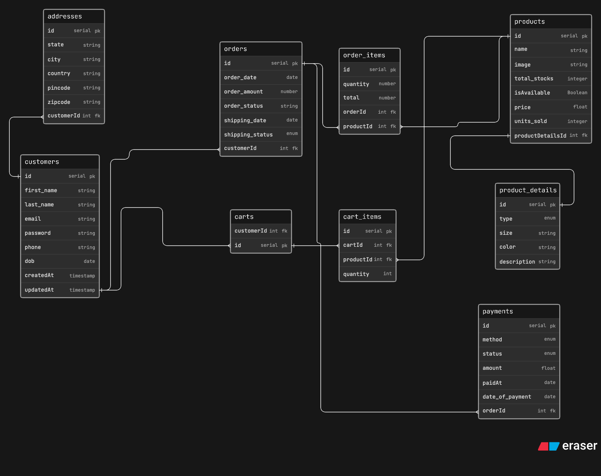

# Intoduction

A small creator has started an Instagram-based store where they sell thrifted fashion items and handmade products. At first, the business is very small and receives orders through Instagram DMs and WhatsApp. Over time, the store starts growing and now the owner wants to manage products better, keep track of available stock, handle customer orders properly, and maintain basic information about delivery and payments.

Some products are thrifted and only have one piece available. Some are handmade and can have multiple units. Some items may have size, color or condition details. The business owner may also want to store customer details, order history, payment status and shipping status.

## ER Diagram

--
Thanks for watching it.
