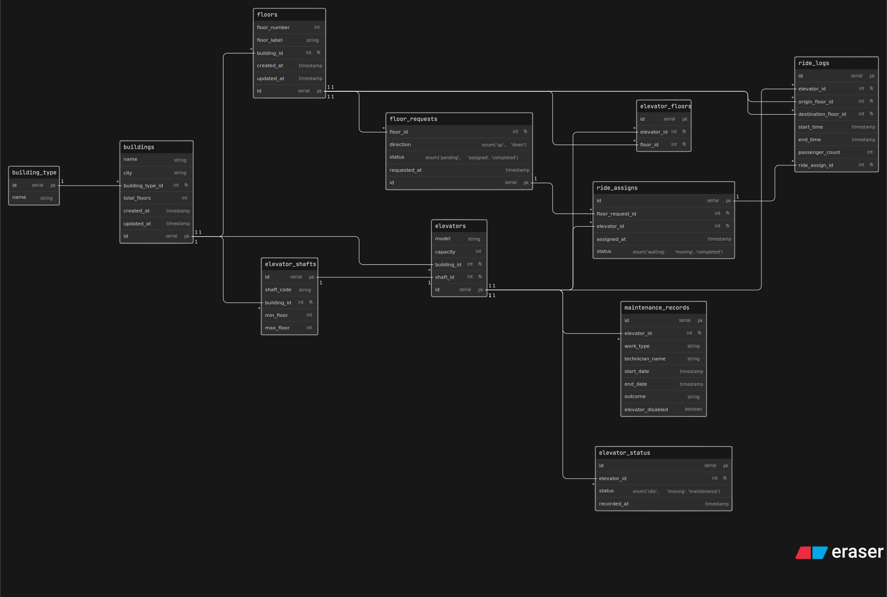

# LiftGrid Systems — Smart Elevator Control Platform

## ER Diagram

This repository contains the database design for **LiftGrid Systems**, an intelligent elevator control platform built for large commercial buildings across India. The system manages multiple elevators across multiple buildings, handling ride requests, floor assignments, maintenance tracking, and usage analytics.

---

## Problem Statement

LiftGrid Systems operates in corporate towers, malls, airports, hospitals, and high-rise residential complexes where dozens of elevators run simultaneously across many floors. The platform needs to track:

- Multiple buildings connected to the platform
- Multiple elevators and shafts per building
- Floor-level ride requests and elevator assignments
- Real-time elevator status monitoring
- Maintenance history per elevator
- Ride logs for analytics and performance reporting

---

## ERD Overview

The diagram is designed around the following core flow:

```
Building → Floors + Elevator Shafts → Elevator
       → serves Floors (via junction table)
       → handles Floor Requests → Ride Assignment → Ride Log
       → tracks Status History
       → records Maintenance
```

---

## Entities

| Entity                | Purpose                                                             |
| --------------------- | ------------------------------------------------------------------- |
| `building_type`       | Categorizes buildings (mall, hospital, corporate tower, etc.)       |
| `buildings`           | Each physical building connected to the platform                    |
| `floors`              | Each floor level inside a building                                  |
| `elevator_shafts`     | Physical shaft slots inside a building with floor range coverage    |
| `elevators`           | The elevator cabin inside a shaft — configuration only              |
| `elevator_floors`     | Junction table — which elevators serve which floors (many-to-many)  |
| `elevator_status`     | Live and historical status per elevator (idle, moving, maintenance) |
| `floor_requests`      | Ride requests generated by users from a floor                       |
| `ride_assigns`        | Assignment of an elevator to handle a floor request                 |
| `ride_logs`           | Completed ride records for analytics and reporting                  |
| `maintenance_records` | Full maintenance history per elevator                               |

---

## Key Design Decisions

- **Elevator is config-only** — dynamic data like current floor and status are stored separately in `elevator_status` to preserve history
- **Many-to-many floors ↔ elevators** — handled via `elevator_floors` junction table since one elevator serves multiple floors and one floor can be served by multiple elevators
- **Requests and assignments are separate** — a `floor_request` exists before an elevator is assigned; `ride_assigns` captures the moment of assignment
- **Ride logs link back to assignments** — `ride_logs.ride_assign_id` connects completed trips to their originating requests
- **Maintenance does not overwrite history** — each record is a new row with start/end dates and an `elevator_disabled` flag

---

## Files

```
/
├── README.md
└── erd.eraser        # ERD source file (Eraser.io format)
```

> You can also export the diagram as an image and include it here as `erd.png`.

---

## Tools Used

- **Eraser.io** — for ER diagram design and visualization
- Diagram syntax: Entity Relationship Diagram (ERD)

---

## Author

Designed as part of a database design assignment for LiftGrid Systems — a multi-building elevator control platform case study.
